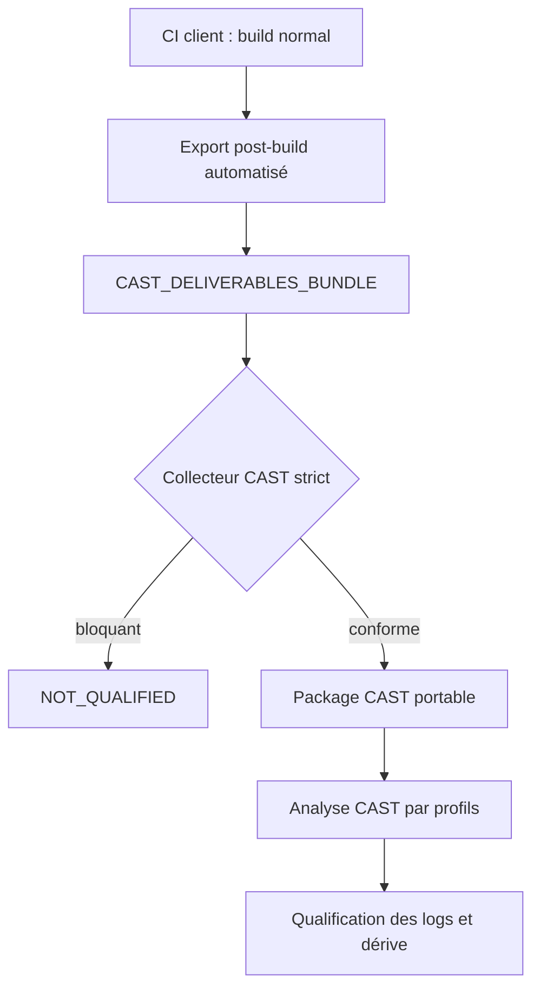
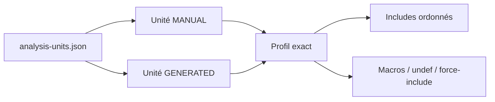

# Collecteur hors ligne CAST Imaging v3 — C/Python, Conan, toolchains C/C++

Version 2.1.0. Cette version de production fournit un flux hors ligne strict pour transformer un bundle de livrables client en package CAST portable.

## Décision d’architecture

L’équipe CAST ne lance ni Conan, ni l’outil de build, ni le compilateur, et ne reconstruit pas les applications. L’équipe client exécute seulement un export post-build dans le job qui possède déjà le cache Conan, le SDK cible et les résultats de compilation. Le collecteur CAST travaille ensuite exclusivement sur le bundle de livrables transféré.



Cette approche ne dépend pas de `CPP Compilation Database Discoverer`. Le `compile_commands.json` est un élément de traçabilité produit par le client ; le collecteur le transforme en profils et en plan de configuration lisibles par l’équipe CAST.

## Répartition des responsabilités

| Activité | Équipe client | Équipe CAST |
|---|---:|---:|
| Compiler et exécuter Conan et la toolchain | Oui | Non |
| Produire identité, graphe, inventaire exact et probes compilateur | Oui, dans la CI | Non |
| Exporter les en-têtes Conan host et SDK/toolchain | Automatique via `client_ci_export.py` | Non |
| Exécuter le collecteur | Non | Oui |
| Décider READY/NOT_QUALIFIED | Non | Automatique puis revue CAST |
| Configurer et lancer Imaging | Non | Oui |

## Contenu client obligatoire

Le bundle de livrables remis à CAST doit contenir au minimum :

```text
CAST_DELIVERABLES_BUNDLE/
├── identity/BUILD_IDENTITY.json
├── source/
├── generated/                         # si code généré séparé
├── compilation/compile_commands.json  # ou compilation-units.json
├── build/*.d                          # recommandé ; absence = avertissement
├── build/*.rsp                        # si référencés par une commande
├── logs/                              # journaux de build transférés tels que fournis
├── conan/
│   ├── packages.json
│   ├── conan-graph.json
│   ├── export/<package-host>/...
│   ├── profiles/
│   └── lockfiles/
├── compiler/
│   ├── qcc-variants.json
│   ├── *.macros.txt
│   └── *.includes.txt
└── qnx/                               # miroir des en-têtes SDK/sysroot, si applicable
```

Les formats normatifs se trouvent dans `schemas/` et des exemples dans `examples/`.

Un kit de transmission client est disponible dans `client-kit/`. Il contient un mode d’emploi court, un fichier de variables à renseigner et un exemple de job CI.

Une variante séparée existe pour le cas où le client fournit déjà une version du code avec makefiles modifiés et travaille uniquement en local. Elle est documentée dans `docs/CLIENT_TEAM_PROCEDURE_MODIFIED_MAKEFILES.md` et `client-kit-modified-makefiles/README.md`.

## Automatisation côté client

### 1. Produire les éléments pendant le build

Le job client conserve le `compile_commands.json` déjà généré par CMake, Bear, une instrumentation interne ou la CI. S’il existe déjà, aucune nouvelle compilation n’est nécessaire. À défaut, le client doit produire `compilation/compilation-units.json` avec les mêmes champs `directory`, `file` et `arguments`. Un journal seul ou des `.d` seuls ne reconstituent pas de façon fiable les macros, l’ordre des `-I` et les response files ; ils ne qualifient donc pas un passage strict.

Pour chaque variante QCC et chaque langage réellement utilisés, exécuter dans le job de build, une fois par image de toolchain :

```sh
printf '' | qcc -Vgcc_ntoaarch64le -x c   -dM -E - > gcc_ntoaarch64le-c.macros.txt
printf '' | qcc -Vgcc_ntoaarch64le -x c   -E -v - > /dev/null 2> gcc_ntoaarch64le-c.includes.txt
printf '' | qcc -Vgcc_ntoaarch64le -x c++ -dM -E - > gcc_ntoaarch64le-cxx.macros.txt
printf '' | qcc -Vgcc_ntoaarch64le -x c++ -E -v - > /dev/null 2> gcc_ntoaarch64le-cxx.includes.txt
```

Créer `qcc-variants.json` selon l’exemple fourni. Ces commandes sont lancées côté client, jamais côté CAST.

### 2. Produire l’inventaire Conan exact

Dans l’environnement Conan du build, exporter un JSON contenant une ligne par nœud du graphe résolu : référence, recipe revision, contexte `host` ou `build`, package ID, package revision et chemin physique exact du package dans ce cache. Il faut utiliser les sorties structurées de la version Conan effectivement installée et la commande de résolution de chemin du cache ; ne pas déduire le package à partir du nom d’un dossier.

Pour Conan 2, le kit automatise cette étape :

```sh
conan graph info . \
  -pr:h profiles/qnx-arm64 \
  -pr:b profiles/linux-x86_64 \
  --format=json > build/cast/conan-graph.json

python3 conan2_inventory.py \
  --graph build/cast/conan-graph.json \
  --output build/cast/packages.pre-export.json
```

Le script construit la référence binaire complète `reference#rrev:package_id#prev` de chaque nœud et appelle `conan cache path` dans ce même environnement. Il ne parcourt pas la structure interne du cache et ne choisit jamais « le premier dossier ressemblant ». Si la structure JSON de la version Conan de l’entreprise diffère, le test d’intégration CI doit être adapté et figé avant transfert à CAST.

Le fichier intermédiaire suit `examples/packages.pre-export.json`. Pour chaque dépendance `host`, `original_root` est le dossier de package exact. Les dépendances `build` restent dans l’inventaire pour la traçabilité mais leurs en-têtes ne sont pas injectés dans CAST. Le graphe brut JSON, les profils et le lockfile sont également conservés.

Le collecteur client copie ensuite uniquement les en-têtes, y compris les fichiers d’en-tête sans extension, vers `conan/export/`, met à jour `exported_root` et génère finalement un `CONAN_INFO.txt` par dépendance dans le package CAST.

### 3. Lancer l’export post-build

Exemple à adapter dans le même conteneur/job que le build :

```sh
python3 client_ci_export.py \
  --bundle "$CI_ARTIFACTS/CAST_DELIVERABLES_BUNDLE" \
  --source "$CI_PROJECT_DIR/src" \
  --generated "$CI_PROJECT_DIR/generated" \
  --build-root "$CI_PROJECT_DIR/build" \
  --compile-commands "$CI_PROJECT_DIR/build/compile_commands.json" \
  --build-log "$CI_PROJECT_DIR/build/build.log" \
  --conan-packages "$CI_PROJECT_DIR/build/cast/packages.pre-export.json" \
  --conan-graph "$CI_PROJECT_DIR/build/cast/conan-graph.json" \
  --conan-lockfile "$CI_PROJECT_DIR/conan.lock" \
  --conan-profile "$CI_PROJECT_DIR/profiles/qnx-arm64" \
  --qnx-target "$QNX_TARGET" \
  --qcc-probe-dir "$CI_PROJECT_DIR/build/cast/compiler" \
  --application "<APPLICATION>" \
  --application-version 2026.09 \
  --target-label qnx-arm64-release \
  --target-os QNX --target-os-version 7.1 \
  --architecture aarch64 --build-type Release \
  --compiler qcc --compiler-version 8.3 \
  --compiler-variant gcc_ntoaarch64le \
  --conan-version 2.8 \
  --host-profile qnx-arm64 --build-profile linux-x86_64 \
  --source-root-at-build "$CI_PROJECT_DIR/src" \
  --generated-root-at-build "$CI_PROJECT_DIR/generated" \
  --qnx-target-at-build "$QNX_TARGET" \
  --matlab-version R2024b --generation-id "$MODEL_BUILD_ID"
```

`git_commit`, `pipeline_id` et `job_id` sont automatiquement lus depuis les variables GitLab, GitHub Actions ou Azure DevOps connues ; ils peuvent aussi être passés explicitement. L’exporteur échoue si l’identité minimale, le package Conan exact ou les en-têtes sont absents. Il ne lance aucun outil de build.

Après l’export, contrôler que les livrables attendus sont présents, puis archiver le dossier sans modification manuelle.

## Exécution côté CAST

```sh
python3 cast_offline_collector.py \
  --input-root /reception/CAST_DELIVERABLES_BUNDLE \
  --output-parent /work/cast-packages \
  --mode strict
```

Codes de sortie : `0` signifie que la collecte est exploitable ; `2` signifie `NOT_QUALIFIED`. En mode strict, aucun ZIP n’est créé si une anomalie critique existe. `--mode exploratory` crée un dossier de diagnostic et retourne `0`, mais son statut reste `EXPLORATORY` et ne doit pas servir de référence.

Pour comparer avec une collecte antérieure :

```sh
python3 cast_offline_collector.py \
  --input-root /reception/CAST_DELIVERABLES_BUNDLE \
  --output-parent /work/cast-packages \
  --baseline /work/cast-packages/previous-package \
  --mode strict
```

## Traitement des options de compilation

Attention à la casse : `-I` majuscule ajoute un répertoire d’inclusion ; `-D` majuscule définit une macro. Les options GCC/QCC `-dM`, `-dD`, `-dN`, `-dI` et `-dU`, avec `d` minuscule, demandent des sorties du préprocesseur ; elles ne définissent pas une macro.

| Option | Traitement |
|---|---|
| `-I`, `-iquote`, `-isystem`, `-idirafter` | Conservées par catégorie et dans l’ordre effectif de recherche |
| `-D`, `-U` | Conservées dans l’ordre dans le profil ; matérialisées dans un force-include par profil |
| `-include`, `-imacros` | Fichier remappé, existence obligatoire, puis intégré au force-include |
| `--sysroot`, `-isysroot`, chemins `=...` | Résolus par commande avant remapping vers le miroir QNX |
| `-Wp,...`, `-Xpreprocessor` | Dépliées pour retrouver les options du préprocesseur |
| `-M`, `-MM`, `-MD`, `-MMD`, `-MF`, `-MT`, `-MQ`, `-MP`, `-MG` | Conservées comme éléments de traçabilité ; les `.d` sont parsés séparément |
| `-dM`, `-dD`, `-dN`, `-dI`, `-dU` | Répertoriées comme options de dump ; jamais confondues avec `-D` |
| `@fichier.rsp` | Déplié récursivement, profondeur limitée ; absence, ambiguïté ou cycle = blocage |
| `-V...` QCC | Relié obligatoirement au probe macro/include correspondant |

Chaque signature distincte (langage, compilateur, variante QCC, standard, ordre des includes, macros, sysroot et force-includes) devient un profil séparé. Le collecteur ne fusionne donc pas arbitrairement deux contextes incompatibles.

## Configuration CAST Imaging

Le package produit contient `cast-config/analysis-units.json` et `CAST_ANALYSIS_PLAN.md`. Pour chaque unité :

1. créer une unité d’analyse C/C++ correspondant au profil ;
2. sélectionner uniquement les sources listées dans `sources` ;
3. résoudre chaque chemin `includes` relativement à la racine extraite du package (`path_base = PACKAGE_ROOT`) et conserver l’ordre ;
4. reporter les macros de `macros` et les undefinitions de `undefined_macros`, ou utiliser le fichier `force_include` généré ;
5. ne pas ajouter les dossiers Conan `build` ; seuls les packages `host` collectés sont présents ;
6. maintenir les unités `MANUAL-*` et `GENERATED-*` séparées, même lorsqu’elles partagent un profil ;
7. configurer Python sur `source/manual` et `source/generated` selon l’emplacement réel des `.py` ; Python ne dépend pas des options GCC/QCC.



Les chemins absolus d’origine ne sont jamais demandés à la machine CAST. Le remapping utilise trois espaces logiques : `source://`, `conan://` et `qnx://`. Les chemins opérationnels dans `analysis-units.json` sont relatifs au package ; `path-remapping.csv` garde la trace de chaque conversion. Toute entrée non remappée est bloquante et figure dans `unresolved-paths.txt`.

Les intitulés précis des écrans peuvent varier avec le niveau de maintenance d’Imaging v3. `CAST_ANALYSIS_PLAN.md` est donc la spécification d’entrée à appliquer, puis à contrôler via les logs d’analyse.

## Qualification et livrables

| Fichier | Usage |
|---|---|
| `collection-status.json` | Verdict machine : `READY_FOR_ANALYSIS`, `NOT_QUALIFIED` ou `EXPLORATORY` |
| `collection-report.json` | Anomalies, compteurs, couverture et synthèse |
| `cast-config/analysis-units.json` | Configuration portable par profil |
| `cast-config/path-remapping.csv` | Trace chemin original → chemin collecté |
| `cast-config/source-coverage-summary.json` | Couverture des sources C/C++ collectées par une commande réelle |
| `cast-config/baseline-diff.json` | Dérive identité/Conan/profils par rapport à un précédent package |
| `qualification.json` | Indicateurs extraits des logs CAST éventuellement fournis |
| `volumetry.json` | Fichiers, octets, lignes manuelles/générées/dépendances/QNX |
| `manifest.sha256` | Intégrité de tous les fichiers du package produit |

Après une première analyse, placer les logs CAST dans `cast-analysis-logs/` du bundle et relancer la collecte. Des indicateurs de header manquant, erreur de préprocesseur, parseur ou symbole inconnu donnent `NOT_QUALIFIED`. Même sans indicateur automatique, une revue humaine reste obligatoire (`QUALIFIED_WITH_RESERVATIONS`).

## Limites résiduelles

- Le collecteur ne prouve pas que le `compile_commands.json` provient réellement du binaire livré ; cette liaison repose sur l’identité CI, le commit, le pipeline et, idéalement, une attestation de l’environnement de build qualifié.
- Les règles conditionnelles internes aux makefiles qui n’ont pas produit de commande ne sont pas analysées. Le périmètre est la cible réellement construite.
- Les extensions propriétaires QCC non observées dans les arguments/probes peuvent nécessiter un réglage CAST complémentaire. Elles doivent alors être ajoutées comme cas de test et non corrigées silencieusement dans les makefiles.
- Une couverture stricte de 100 % suppose que le dossier `source/` soit limité au périmètre de la cible. Si le dépôt contient plusieurs cibles, exporter seulement les sources de la cible ou produire un bundle par cible.

## Flux recommandé sans modification des makefiles

L’export post-build évite une divergence avec le build qualifié, conserve les options réellement utilisées, ne touche pas au produit et reste réutilisable pour x86/ARM/Linux/QNX. Une modification des makefiles peut sembler plus directe mais crée une variante spécifique CAST, demande de maintenir les chemins Conan en double, risque de changer l’ordre des includes/macros et doit être revalidée à chaque évolution de l’environnement de build.

En contrepartie, la solution recommandée exige une discipline d’artefacts CI et un export exact du cache. Les contrôles stricts, l’inventaire signé optionnel, les profils séparés, la couverture et la baseline réduisent ce risque sans déplacer Conan ou QCC vers l’équipe CAST.

Si les makefiles ont déjà été modifiés côté client, utiliser la variante locale dédiée plutôt que cette procédure standard. Dans ce cas, les makefiles produisent un staging local, puis `makefile_local_export.py` le normalise en `CAST_DELIVERABLES_BUNDLE`. Si CAST reçoit une arborescence locale incomplète, `makefile_local_audit.py` confirme les livrables manquants. Lorsque le staging complet ne peut pas être redemandé, `makefile_local_recover.py` reconstruit un dossier de récupération partielle à partir des répertoires `build` présents sous la racine locale.

## Tests

```sh
python3 -m unittest discover -s tests -v
python3 -m py_compile cast_offline_collector.py client_ci_export.py makefile_local_export.py makefile_local_audit.py makefile_local_recover.py
```

Le code utilise uniquement la bibliothèque standard Python 3.9+.

La procédure pas-à-pas destinée à la CI et à l’équipe plateforme/toolchain est disponible dans `docs/CLIENT_TEAM_PROCEDURE.md`.

La procédure opérationnelle de production destinée aux équipes CAST est disponible dans `docs/CAST_TEAM_PROCEDURE.md`.

Le mode d’emploi du kit à remettre à l’équipe client est disponible dans `client-kit/README.md`.

Le mode d’emploi de la variante locale avec makefiles modifiés est disponible dans `client-kit-modified-makefiles/README.md`.

## Dépôt Git et CI

Le dépôt est autonome. Le même contrôle est utilisé localement, dans GitHub Actions et dans GitLab CI :

```sh
python3 ci/quality_gate.py
```

La release reproductible est générée ainsi :

```sh
python3 tools/release.py
```

La commande crée dans `dist/` une archive versionnée et son fichier SHA-256. Les pipelines fournis ne nécessitent aucun paquet Python tiers pour tester ou conditionner le collecteur. Avant publication interne, appliquer les règles de branche, la revue obligatoire et la signature de tag propres à l’organisation.
