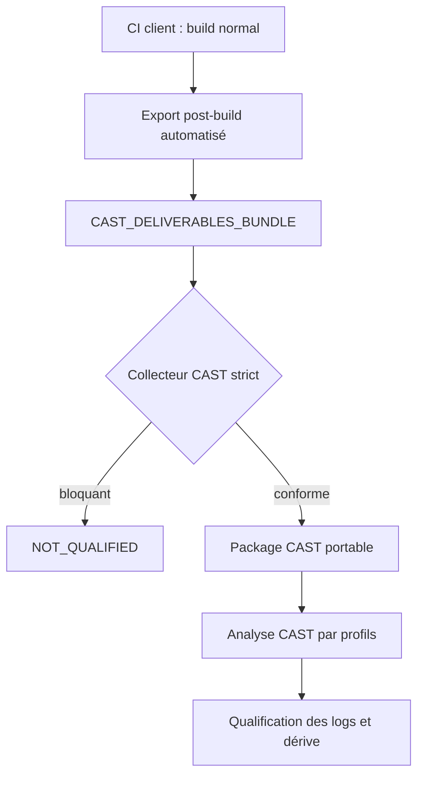

# Procédure client — production d’un bundle de livrables CAST

Version de procédure : 1.1 — procédure générique pour le collecteur CAST

Cette procédure décrit comment produire un bundle de livrables exploitable par l’équipe CAST à partir d’un build client existant. Elle s’applique à toute application, cible, architecture, système d’exploitation, compilateur ou profil Conan réellement remis à l’équipe CAST.

La procédure est exécutée par l’équipe client dans la CI ou tout environnement équivalent qui réalise déjà le build qualifié. L’équipe CAST ne lance ni Conan, ni l’outil de build, ni le compilateur, et ne reconstruit pas l’application.

Les valeurs entre chevrons, par exemple `<APPLICATION>`, `<TARGET_OS>` ou `<COMPILER_VARIANT>`, sont à remplacer par les valeurs du contexte client.

## 1. Décision d’architecture

L’équipe CAST ne lance ni Conan, ni l’outil de build, ni le compilateur, et ne reconstruit pas l’application. L’équipe client exécute un export post-build dans le job qui possède déjà le cache Conan, le SDK cible, les profils de build et les résultats de compilation.

Le collecteur CAST travaille ensuite exclusivement sur le bundle de livrables transféré.



Cette approche ne dépend pas de `CPP Compilation Database Discoverer`. Le `compile_commands.json` est un élément de traçabilité produit par le client ; le collecteur le transforme en profils et en plan de configuration lisibles par l’équipe CAST.

## 2. Répartition des responsabilités

| Activité | Équipe client | Équipe CAST |
|---|---:|---:|
| Build normal et tests produit | Oui | Non |
| Résolution Conan et accès au cache local | Oui | Non |
| Production de l’identité, du graphe Conan, des package IDs et des chemins | Oui | Non |
| Production de `compile_commands.json` | Oui | Non |
| Production des probes compilateur | Oui | Non |
| Export des en-têtes Conan `host` et SDK/toolchain | Oui, automatisé | Non |
| Génération de `BUILD_IDENTITY.json` | Oui, automatisée | Vérification |
| Configuration CAST Imaging | Non | Oui |
| Correction d’un bundle rejeté | Oui | Diagnostic |

## 3. Contenu client obligatoire

Le bundle de livrables remis à CAST doit contenir au minimum :

```text
CAST_DELIVERABLES_BUNDLE/
├── identity/BUILD_IDENTITY.json
├── source/
├── generated/                         # si code généré séparé
├── compilation/compile_commands.json  # ou compilation-units.json
├── build/*.d                          # recommandé ; absence = avertissement
├── build/*.rsp                        # si référencés par une commande
├── logs/                              # journaux de build transférés tels que fournis
├── conan/
│   ├── packages.json
│   ├── conan-graph.json
│   ├── export/<package-host>/...
│   ├── profiles/
│   └── lockfiles/
├── compiler/
│   ├── qcc-variants.json              # ou fichier équivalent attendu par CAST
│   ├── *.macros.txt
│   └── *.includes.txt
└── qnx/                               # miroir des en-têtes SDK/sysroot, si applicable
```

Les formats normatifs se trouvent dans `schemas/` et des exemples dans `examples/`.

## 4. Automatisation côté client

L’automatisation côté client doit suivre ce principe : produire les éléments nécessaires pendant le build qualifié, puis exporter les livrables sans relancer Conan, le build ou le compilateur pour CAST.

Le job client doit notamment :

1. conserver ou produire `compile_commands.json` dans le contexte du build qualifié ;
2. produire les probes compilateur pour chaque variante et langage réellement utilisés ;
3. produire l’inventaire Conan exact depuis le graphe du build ;
4. exporter les en-têtes Conan `host` et les en-têtes SDK/toolchain nécessaires ;
5. générer `identity/BUILD_IDENTITY.json` avec les métadonnées du build ;
6. archiver le bundle de livrables après contrôle de son contenu.

## 5. Objectif et résultat attendu

À la fin du job, la CI doit déposer un répertoire autonome :

```text
<DELIVERABLES_BUNDLE>/
```

Par convention, ce répertoire peut être nommé `CAST_DELIVERABLES_BUNDLE/`. Il permet à CAST de reconstruire les unités d’analyse et leurs chemins sans accès au cache Conan, au SDK, aux secrets, au réseau de build ou à la machine de build.

Le job client doit produire un bundle par combinaison :

```text
application × commit × cible × architecture × build_type × profil Conan × compilateur
```

Ne pas mélanger deux applications, deux cibles, deux architectures, deux variantes de compilateur ou deux profils Conan dans un même bundle.

## 6. Règles impératives

1. Exécuter l’export après un build réussi, dans le même job et le même environnement de toolchain.
2. Ne jamais reconstruire pour CAST avec des options différentes du produit livré.
3. Ne jamais laisser l’équipe CAST accéder au cache Conan, au SDK client, aux secrets CI ou au réseau de build.
4. Produire un bundle séparé par cible et par application.
5. Ne pas modifier le bundle après validation de son contenu par le job CI.
6. Ne pas remplacer un chemin Conan par une supposition basée sur le nom du dossier.
7. Conserver le job, le commit, le graphe Conan et le bundle comme un même ensemble de traçabilité.

## 7. Préparer les entrées du job

Avant de lancer `client_ci_export.py`, vérifier que le job dispose de :

```text
SRC_ROOT/                         sources manuelles C/C++/Python et headers
GENERATED_ROOT/                   code généré, si séparé du code manuel
BUILD_ROOT/                       compile_commands.json, .d, .rsp et journaux
CONAN_GRAPH_JSON                  graphe Conan résolu du build
CONAN_LOCKFILE(S)                 lockfile réellement utilisé
CONAN_PROFILE(S)                  profils host et build réellement utilisés
SDK_ROOT                          racine du SDK ou sysroot, si applicable
COMPILER_PROBE_DIR                probes macros/includes par compilateur, variante et langage
```

Le dossier source doit être limité au périmètre de l’application et de la cible. Si le dépôt contient plusieurs applications ou plusieurs produits, filtrer avant l’export afin que la vérification de couverture à 100 % soit significative.

## 8. Produire `compile_commands.json`

Le fichier doit contenir une entrée par source réellement compilée, avec au minimum :

```json
[
  {
    "directory": "/ci/work/<APPLICATION>",
    "file": "/ci/work/<APPLICATION>/src/main.c",
    "arguments": ["<COMPILER>", "-I/...", "-DPRODUCT=1", "-c", "/ci/work/<APPLICATION>/src/main.c"]
  }
]
```

Les champs `arguments` sont préférés à `command`, car ils évitent une nouvelle interprétation shell. Si seule la forme `command` existe, conserver la commande complète telle qu’exécutée.

Le fichier doit être produit pendant le build qualifié, pas reconstruit après coup avec une configuration différente.

### 8.1 Avec CMake

Si le build utilise CMake avec Makefiles ou Ninja, activer l’export de la compilation database dans la configuration :

```sh
cmake -S "$SRC_ROOT" -B "$BUILD_ROOT" \
  -DCMAKE_EXPORT_COMPILE_COMMANDS=ON \
  <OPTIONS_CMAKE_DU_BUILD_PRODUIT>

cmake --build "$BUILD_ROOT" -- <OPTIONS_BUILD_PRODUIT>
```

Le fichier attendu est alors :

```text
$BUILD_ROOT/compile_commands.json
```

Vérifier qu’il correspond bien à la cible livrée et qu’il n’a pas été généré depuis une configuration de développement différente.

### 8.2 Avec un build Make, Ninja ou script propriétaire

Si le build ne produit pas nativement `compile_commands.json`, l’équipe client doit instrumenter le build existant pour capturer les commandes réelles de compilation. Utiliser l’outil déjà validé dans l’environnement client, par exemple Bear, intercept-build ou un mécanisme interne de CI.

Exemple avec Bear :

```sh
bear --output "$BUILD_ROOT/compile_commands.json" -- \
  <COMMANDE_BUILD_PRODUIT>
```

Exemple avec intercept-build :

```sh
intercept-build --cdb "$BUILD_ROOT/compile_commands.json" \
  <COMMANDE_BUILD_PRODUIT>
```

La commande instrumentée doit être la commande de build produit habituelle. Ne pas simplifier les options, changer de profil Conan, changer de cible ou remplacer le compilateur.

### 8.3 Avec une compilation database interne

Si la CI produit déjà un inventaire structuré des unités compilées, exporter ce contenu au format `compile_commands.json`. Chaque entrée doit contenir :

- `directory` : répertoire courant utilisé au moment de la compilation ;
- `file` : source réellement compilée ;
- `arguments` : liste ordonnée des arguments transmis au compilateur, de préférence sans repasser par un shell ;
- ou `command` : commande complète si la forme `arguments` n’est pas disponible.

Si aucun export direct n’est possible, produire `compilation/compilation-units.json` avec les mêmes informations minimales (`directory`, `file`, `arguments`) et documenter la transformation vers `compile_commands.json`.

Contrôles client :

- le fichier est un tableau JSON non vide ;
- chaque `file` existe dans le workspace de build ;
- les chemins `-include` et `-imacros` existent ;
- les response files `@xxx.rsp` sont archivés ;
- les commandes contiennent le compilateur et, si nécessaire, la variante de compilateur utilisée par le build ;
- aucune entrée ne pointe vers une ancienne version de source ou de cache.

Si le build utilise déjà un `compile_commands.json`, le réutiliser. Il ne faut pas relancer une compilation uniquement pour CAST.

## 9. Produire les probes compilateur

Pour chaque couple réellement utilisé `(compilateur, variante, langage)`, produire les fichiers de macros et de chemins d’inclusion implicites dans `COMPILER_PROBE_DIR`.

Le principe est identique quel que soit le compilateur : les probes doivent être produits avec la même image, le même sysroot, les mêmes variables d’environnement et la même variante que le build. Si le compilateur ne fournit pas de mécanisme équivalent, documenter explicitement la méthode utilisée pour capturer les macros et includes implicites.

Exemple générique GCC/Clang C :

```sh
printf '' | "$COMPILER" -x c -dM -E - \
  > "$COMPILER_PROBE_DIR/${COMPILER_ID}-c.macros.txt"

printf '' | "$COMPILER" -x c -E -v - \
  > /dev/null \
  2> "$COMPILER_PROBE_DIR/${COMPILER_ID}-c.includes.txt"
```

Exemple QCC C, si la toolchain utilise QCC :

```sh
printf '' | qcc -Vgcc_ntoaarch64le -x c -dM -E - \
  > "$COMPILER_PROBE_DIR/gcc_ntoaarch64le-c.macros.txt"

printf '' | qcc -Vgcc_ntoaarch64le -x c -E -v - \
  > /dev/null \
  2> "$COMPILER_PROBE_DIR/gcc_ntoaarch64le-c.includes.txt"
```

Exemple QCC C++, si nécessaire :

```sh
printf '' | qcc -Vgcc_ntoaarch64le -x c++ -dM -E - \
  > "$COMPILER_PROBE_DIR/gcc_ntoaarch64le-cxx.macros.txt"

printf '' | qcc -Vgcc_ntoaarch64le -x c++ -E -v - \
  > /dev/null \
  2> "$COMPILER_PROBE_DIR/gcc_ntoaarch64le-cxx.includes.txt"
```

Créer ensuite le fichier de variantes attendu par CAST, par exemple `compiler-variants.json` ou `qcc-variants.json` selon le projet :

```json
{
  "schema_version": 1,
  "variants": [
    {
      "variant": "<COMPILER_VARIANT>",
      "language": "c",
      "macros_file": "compiler/<COMPILER_VARIANT>-c.macros.txt",
      "include_search_file": "compiler/<COMPILER_VARIANT>-c.includes.txt"
    },
    {
      "variant": "<COMPILER_VARIANT>",
      "language": "c++",
      "macros_file": "compiler/<COMPILER_VARIANT>-cxx.macros.txt",
      "include_search_file": "compiler/<COMPILER_VARIANT>-cxx.includes.txt"
    }
  ]
}
```

Conserver le nom attendu par les scripts du projet. Si le dépôt fournit uniquement le schéma `qcc-variants.json`, l’utiliser comme fichier de description des variantes compilateur, même lorsque la procédure est appliquée à un contexte plus large.

## 10. Produire l’inventaire Conan exact

### Conan 2

Depuis le répertoire du consumer et avec les profils réellement utilisés :

```sh
conan graph info . \
  -pr:h "$HOST_PROFILE" \
  -pr:b "$BUILD_PROFILE" \
  --format=json > "$BUILD_ROOT/cast/conan-graph.json"

python3 conan2_inventory.py \
  --graph "$BUILD_ROOT/cast/conan-graph.json" \
  --output "$BUILD_ROOT/cast/packages.pre-export.json"
```

Le script appelle `conan cache path` pour chaque nœud binaire et enregistre :

```text
reference
recipe_revision
context = host | build
package_id
package_revision
original_root
logical_root
```

### Conan 1 ou format de graphe interne

Si la version Conan utilisée ne produit pas le format attendu, le job doit générer le même JSON à partir de ses sorties structurées. Le fichier doit toujours contenir une ligne par identité exacte. Une recherche heuristique par nom de répertoire est interdite.

Exemple minimal :

```json
{
  "schema_version": 1,
  "packages": [
    {
      "reference": "middleware/4.2@company/stable",
      "recipe_revision": "rrev-sha",
      "context": "host",
      "package_id": "package-id-sha",
      "package_revision": "prev-sha",
      "original_root": "/conan-cache/p/middleware-package",
      "logical_root": "conan://middleware/4.2/package-id-sha",
      "exported_root": ""
    }
  ]
}
```

Règles :

- `host` : headers nécessaires à l’analyse ; `original_root` obligatoire ;
- `build` : traçabilité uniquement ; ses headers ne sont pas injectés ;
- ne pas dédupliquer deux package IDs différents ;
- inclure RREV et PREV lorsqu’ils existent ;
- conserver le graphe brut et le lockfile dans le bundle.

## 11. Collecter les headers Conan et SDK/toolchain

`client_ci_export.py` copie automatiquement :

- les headers Conan `host` vers `conan/export/<package>` ;
- les headers du SDK ou sysroot depuis `SDK_ROOT` vers le dossier dédié du bundle, si applicable ;
- les headers sans extension s’ils sont textuels ;
- les liens symboliques internes en fichiers matérialisés ;
- aucun lien sortant de la racine n’est accepté.

Ne pas copier tout le cache Conan. Ne pas copier les packages `build` dans les dépendances d’analyse. Les bibliothèques binaires ne sont pas nécessaires pour l’analyse statique des sources et peuvent contenir des données inutiles ou sensibles.

Si le contexte n’utilise pas de SDK externe, le dossier correspondant peut être absent. Cette absence doit être cohérente avec les chemins présents dans `compile_commands.json`.

## 12. Collecter les journaux et dépendances

Le job doit conserver :

```text
BUILD_ROOT/*.d
BUILD_ROOT/*.rsp
BUILD_ROOT/compile_commands.json
BUILD_LOG
CONAN_GRAPH_JSON
CONAN_LOCKFILE(S)
CONAN_PROFILE(S)
```

Les fichiers `.d` servent d’éléments de traçabilité complémentaires. Ils ne remplacent pas la compilation database : ils ne suffisent pas à reproduire l’ordre des includes, les macros et les options spécifiques du compilateur.

## 13. Générer automatiquement l’identité

Lancer `client_ci_export.py` avec les métadonnées du build :

```sh
python3 client_ci_export.py \
  --bundle "$ARTIFACT_DIR/<DELIVERABLES_BUNDLE>" \
  --source "$SRC_ROOT" \
  --generated "$GENERATED_ROOT" \
  --build-root "$BUILD_ROOT" \
  --compile-commands "$BUILD_ROOT/compile_commands.json" \
  --conan-packages "$BUILD_ROOT/cast/packages.pre-export.json" \
  --conan-graph "$BUILD_ROOT/cast/conan-graph.json" \
  --qnx-target "$SDK_ROOT" \
  --qcc-probe-dir "$COMPILER_PROBE_DIR" \
  --application "$APPLICATION" \
  --application-version "$APPLICATION_VERSION" \
  --target-label "$TARGET_LABEL" \
  --target-os "$TARGET_OS" \
  --target-os-version "$TARGET_OS_VERSION" \
  --architecture "$TARGET_ARCH" \
  --build-type "$BUILD_TYPE" \
  --compiler "$COMPILER" \
  --compiler-version "$COMPILER_VERSION" \
  --compiler-variant "$COMPILER_VARIANT" \
  --conan-version "$CONAN_VERSION" \
  --host-profile "$HOST_PROFILE" \
  --build-profile "$BUILD_PROFILE" \
  --source-root-at-build "$SRC_ROOT" \
  --generated-root-at-build "$GENERATED_ROOT" \
  --qnx-target-at-build "$SDK_ROOT" \
  --matlab-version "$CODE_GENERATOR_VERSION" \
  --generation-id "$CODE_GENERATION_ID"
```

Les noms d’options `--qnx-target`, `--qnx-target-at-build`, `--qcc-probe-dir` et `--matlab-version` sont conservés pour compatibilité avec les scripts existants. Les renseigner uniquement si elles correspondent au contexte. Lorsqu’elles sont utilisées pour un SDK, un compilateur ou un générateur non QNX/QCC/Matlab, documenter la convention retenue dans le job CI.

Le script lit automatiquement `CI_COMMIT_SHA`, `GITHUB_SHA` ou `BUILD_SOURCEVERSION` pour le commit, ainsi que les identifiants de pipeline/job connus. Dans un environnement différent, fournir explicitement `--git-commit`, `--pipeline-id` et `--job-id`.

Le fichier `identity/BUILD_IDENTITY.json` est créé par le script.

## 14. Contrôler le contenu du bundle

Après l’exécution de `client_ci_export.py`, le job doit vérifier que le contenu attendu est présent avant archivage :

1. `identity/BUILD_IDENTITY.json` existe ;
2. `compile_commands.json` est présent dans le dossier de compilation du bundle ;
3. les graphes, profils et lockfiles Conan attendus sont présents ;
4. les headers Conan `host` et les headers SDK/toolchain nécessaires sont présents ;
5. les journaux et fichiers `.d` ou `.rsp` disponibles sont inclus.

Archiver ensuite le dossier sans modification manuelle.

## 15. Exemple de job CI complet

```sh
set -eu

python3 conan2_inventory.py \
  --graph "$BUILD_ROOT/cast/conan-graph.json" \
  --output "$BUILD_ROOT/cast/packages.pre-export.json"

python3 client_ci_export.py \
  --bundle "$ARTIFACT_DIR/<DELIVERABLES_BUNDLE>" \
  --source "$SRC_ROOT" \
  --generated "$GENERATED_ROOT" \
  --build-root "$BUILD_ROOT" \
  --compile-commands "$BUILD_ROOT/compile_commands.json" \
  --build-log "$BUILD_ROOT/build.log" \
  --conan-packages "$BUILD_ROOT/cast/packages.pre-export.json" \
  --conan-graph "$BUILD_ROOT/cast/conan-graph.json" \
  --conan-lockfile "$CONAN_LOCKFILE" \
  --conan-profile "$HOST_PROFILE_FILE" \
  --qnx-target "$SDK_ROOT" \
  --qcc-probe-dir "$COMPILER_PROBE_DIR" \
  --application "$APPLICATION" \
  --target-label "$TARGET_LABEL" \
  --target-os "$TARGET_OS" \
  --architecture "$TARGET_ARCH" \
  --build-type "$BUILD_TYPE" \
  --compiler "$COMPILER" \
  --compiler-variant "$COMPILER_VARIANT" \
  --host-profile "$HOST_PROFILE" \
  --build-profile "$BUILD_PROFILE" \
  --source-root-at-build "$SRC_ROOT"
```

Le job doit échouer si l’une des deux commandes retourne un code différent de zéro.

## 16. Liste de contrôle avant transfert

- [ ] Le build de l’application est terminé avec succès.
- [ ] Le bundle correspond à une seule application et une seule cible.
- [ ] `BUILD_IDENTITY.json` contient commit, pipeline, cible, OS, architecture, compilateur et profils Conan.
- [ ] `compile_commands.json` est présent et non vide.
- [ ] Toutes les response files référencées sont présentes.
- [ ] Les probes compilateur couvrent chaque variante/langage utilisé.
- [ ] `conan-graph.json`, `packages.json`, profils et lockfiles sont présents.
- [ ] Les headers Conan `host` et les headers SDK/toolchain nécessaires sont copiés.
- [ ] Les `.d` et journaux sont présents si disponibles.
- [ ] Le répertoire est archivé sans modification.

## 17. Diagnostic d’un rejet CAST

| Code de rejet | Cause probable | Correction côté client |
|---|---|---|
| `IDENTITY-*` | métadonnée manquante ou incohérente | compléter les options d’identité et régénérer |
| `CONAN-GRAPH-MISMATCH` | package ID/RREV/PREV incorrect | régénérer l’inventaire depuis le graphe exact |
| `CONAN-EXPORT-MISSING` | cache indisponible ou chemin relatif incorrect | relancer l’export dans l’environnement Conan |
| `QCC-PROBE-*` ou `COMPILER-PROBE-*` | variante ou fichier de probe manquant | produire le probe dans la même toolchain |
| `RESPONSE-*` | `.rsp` absent, ambigu ou cyclique | archiver le fichier référencé et vérifier le chemin |
| `INCLUDE-UNRESOLVED` | `-I`, sysroot ou header hors bundle | ajouter le miroir correspondant, sans modifier la commande |
| `SOURCE-COVERAGE-INCOMPLETE` | source hors compilation database | exporter le bon périmètre ou corriger la traçabilité du build |

Ne pas corriger les chemins à la main dans le package CAST. Toute correction doit être faite dans le job client puis suivie d’un nouvel export complet.

## 18. Transfert à CAST

Transmettre à CAST :

1. l’archive du bundle de livrables, par convention `CAST_DELIVERABLES_BUNDLE` ;
2. l’identifiant du commit et du pipeline ;
3. l’application, la cible et le profil Conan.

