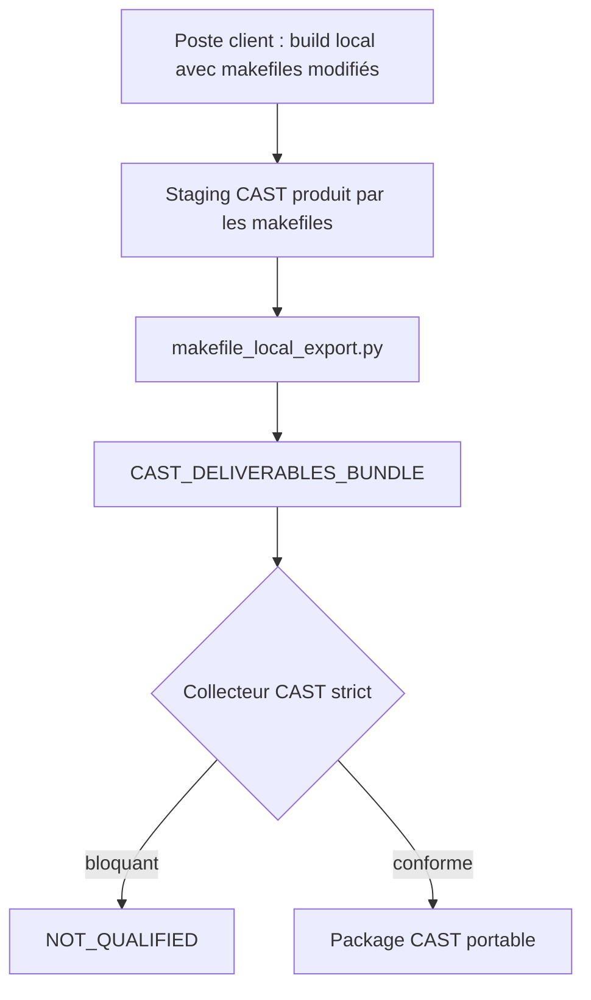

# Procédure client — variante avec makefiles modifiés

Version de procédure : 1.0 — variante dédiée aux dépôts où les makefiles client ont été adaptés pour produire les livrables CAST pendant le build qualifié.

Cette procédure ne remplace pas `docs/CLIENT_TEAM_PROCEDURE.md`. Elle s’applique uniquement lorsque l’équipe client fournit une version du code dont les makefiles copient déjà les éléments nécessaires à CAST dans un répertoire de staging local.

Le principe change côté client : les makefiles produisent le staging pendant un build local, puis `makefile_local_export.py` normalise ce staging en `CAST_DELIVERABLES_BUNDLE`. L’équipe CAST continue d’exécuter le collecteur hors ligne sur le bundle reçu.

## 1. Décision d’architecture

L’équipe client reste responsable du build local, de Conan, de la toolchain, du SDK et des makefiles modifiés. L’équipe CAST n’exécute pas ces makefiles et ne reconstruit pas l’application.



Cette variante est acceptable si les makefiles modifiés sont ceux du build qualifié ou si leur usage CAST est explicitement validé par le client.

## 2. Responsabilités

| Activité | Équipe client | Équipe CAST |
|---|---:|---:|
| Maintenir les makefiles modifiés | Oui | Non |
| Compiler l’application | Oui | Non |
| Produire le staging CAST pendant le build local | Oui | Non |
| Normaliser le staging en bundle | Oui | Non |
| Exécuter le collecteur CAST | Non | Oui |
| Corriger un rejet lié au staging ou aux makefiles | Oui | Diagnostic |

## 3. Staging attendu

Les makefiles doivent produire un répertoire de staging contenant au minimum :

```text
CAST_MAKEFILE_STAGING/
├── source/
├── compilation/
│   └── compile_commands.json          # ou compilation-units.json
├── conan/
│   ├── packages.json
│   ├── conan-graph.json
│   ├── export/<package-host>/...
│   ├── profiles/
│   └── lockfiles/
├── compiler/
│   ├── qcc-variants.json              # ou fichier équivalent attendu par CAST
│   ├── *.macros.txt
│   └── *.includes.txt
├── build/                             # .d, .rsp ou fichiers équivalents
├── logs/
├── generated/                         # si applicable
└── qnx/                               # si applicable
```

Le staging peut déjà contenir `identity/BUILD_IDENTITY.json`. Sinon `makefile_local_export.py` le génère à partir des options de ligne de commande.

Une archive limitée au répertoire `build/` ne constitue pas un staging CAST complet. Elle peut contenir des indices utiles comme `CMakeCache.txt`, `CMakeFiles/*/build.make`, `flags.make`, des `.o.d` ou `conanbuildinfo.txt`, mais elle ne remplace pas :

- les sources et en-têtes collectés ;
- `compilation/compile_commands.json` ou `compilation/compilation-units.json` ;
- `conan/packages.json`, `conan/conan-graph.json` et les en-têtes Conan exportés ;
- `compiler/qcc-variants.json`, `*.macros.txt` et `*.includes.txt`.

Dans ce cas, extraire ou monter l’arborescence localement, puis exécuter seulement un audit de diagnostic :

```sh
python3 makefile_local_audit.py --root /local/LCCS_Archive_CAST
```

Un résultat `DIAGNOSTIC_ONLY` confirme que l’arborescence ne doit pas être transmise comme bundle CAST. Le client doit relancer le build local avec les makefiles modifiés et produire le staging complet.

Si le client ne peut pas régénérer ce staging, l’équipe CAST peut uniquement lancer une récupération partielle depuis le répertoire racine local :

```sh
python3 makefile_local_recover.py \
  --root /local/LCCS_Archive_CAST \
  --output recovered-from-root
```

Cette récupération produit d’abord un inventaire des éléments présents pour toutes les applications détectées : répertoires `build`, `build.make`, `flags.make`, `conaninfo.txt`, `conanbuildinfo.txt`, `.o.d`, sources, includes et en-têtes Conan. Elle génère `compile_commands.json` seulement si les fichiers CMake nécessaires sont présents.

Pour isoler une seule application, ajouter `--application <NOM_APPLICATION>` :

```sh
python3 makefile_local_recover.py \
  --root /local/LCCS_Archive_CAST \
  --application <NOM_APPLICATION> \
  --output recovered-from-root
```

Le résultat reste un dossier de travail de récupération. Il ne devient un bundle strict que si tous les éléments listés dans `recovery-report.json` sont couverts localement et que les probes compilateur sont disponibles.

## 4. Règles impératives

1. Produire le staging pendant le build local qualifié.
2. Ne pas produire un staging depuis une cible, une architecture ou un profil différent du produit livré.
3. Ne pas corriger manuellement `compile_commands.json`, les chemins Conan ou les probes après le build.
4. Produire un staging et un bundle par application, cible, architecture, type de build, profil Conan et variante compilateur.
5. Conserver la version des makefiles modifiés avec le commit applicatif analysé.

## 5. Normaliser le staging

Exemple de commande :

```sh
python3 makefile_local_export.py \
  --staged-root "$PWD/build/cast/staging" \
  --bundle "$PWD/build/cast/CAST_DELIVERABLES_BUNDLE" \
  --application "$APPLICATION" \
  --application-version "$APPLICATION_VERSION" \
  --git-commit "$GIT_COMMIT" \
  --run-id "$LOCAL_RUN_ID" \
  --target-label "$TARGET_LABEL" \
  --target-os "$TARGET_OS" \
  --target-os-version "$TARGET_OS_VERSION" \
  --architecture "$TARGET_ARCH" \
  --build-type "$BUILD_TYPE" \
  --compiler "$COMPILER" \
  --compiler-version "$COMPILER_VERSION" \
  --compiler-variant "$COMPILER_VARIANT" \
  --conan-version "$CONAN_VERSION" \
  --host-profile "$HOST_PROFILE" \
  --build-profile "$BUILD_PROFILE" \
  --source-root-at-build "$SRC_ROOT" \
  --generated-root-at-build "$GENERATED_ROOT" \
  --qnx-target-at-build "$SDK_ROOT"
```

Le script copie uniquement le staging déjà produit. Il ne lance ni `make`, ni Conan, ni compilateur.

Codes de sortie :

| Code | Signification |
|---:|---|
| 0 | bundle prêt au transfert |
| 2 | staging incomplet ou non transférable |

## 6. Contrôles client avant transfert

- [ ] Le build local produit a réussi.
- [ ] Le staging CAST provient de ce build local.
- [ ] `compilation/compile_commands.json` ou `compilation/compilation-units.json` est présent.
- [ ] `conan/packages.json` et `conan/conan-graph.json` sont présents si Conan est utilisé.
- [ ] Les headers Conan `host` sont présents dans `conan/export/`.
- [ ] Les probes compilateur couvrent les variantes et langages réellement utilisés.
- [ ] Les response files référencées sont présentes.
- [ ] Le bundle généré par `makefile_local_export.py` correspond à une seule application et une seule cible.

## 7. Transfert à CAST

Transmettre :

1. l’archive de `CAST_DELIVERABLES_BUNDLE` ;
2. le commit contenant les makefiles modifiés ;
3. l’identifiant local de génération choisi avec `--run-id` ;
4. l’application, la cible, l’architecture, le type de build et le profil Conan ;
5. la fiche `client-kit-modified-makefiles/CLIENT_CONTEXT_FORM_MODIFIED_MAKEFILES.md` remplie.

En cas de rejet CAST, toute correction doit être faite dans les makefiles ou dans l’environnement local client, puis suivie d’un nouveau build local et d’un nouveau bundle.
